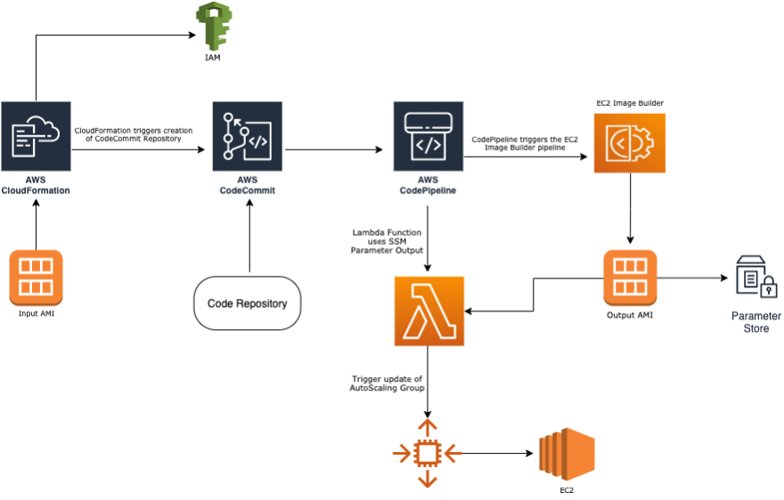

# Automate Amazon EC2 AMI creation with CI/CD pipeline on AWS

Customers often want to automate the rollout of new golden Amazon Machine Images (AMI) within their production fleet whenever there are security patches, software updates or application code changes.

Amazon EC2 Image Builder simplifies the creation, maintenance, validation, sharing and  deployment of Linux or Windows Server images for use with Amazon EC2 and on-premises. EC2 Image Builder significantly reduces the effort required to create and maintain golden images without writing and maintaining automation. Customers create an automated pipeline using an intuitive wizard in the AWS Management Console . When software updates become available, EC2 Image Builder automatically produces a new image without requiring users to manually initiate image builds.

## Deployment Steps

•	Deploy a CloudFormation template that creates CodeCommit repository and CodePipeline pipeline. You must provide an existing Autoscaling Group name. 
•	Upload your code to your Git repository, we will be using CodeCommit in this blog, but you can use GitHub. Once the code is committed, it automatically triggers creation of another CloudFormation stack, which triggers the launch of EC2 Image Builder pipeline. This creates a golden AMI based on the Image Builder components and recipes in your committed code. The CodeCommit repository orchestrates pipeline and listens for new commits.
•	Image Builder kicks-off the build and test phases defined on the Image Builder recipe. The sample EC2 Image Builder CloudFormation template used for this post is [here](https://github.com/aws-samples/amazon-ec2-image-builder-samples/blob/master/CloudFormation/Linux/ubuntu-with-net5/ubuntuserver20-with-.net5.yml).
•	The output AMI ID is saved in Systems Manager Parameter Store.
•	The lambda function uses the Systems Manager Parameter Store value to create a new Launch Configuration which is used in the update the updated Autoscaling Group.

For the full solution overview visit Blog link.

## Pre-requisites:

1.	An AWS IAM user/role with permissions to create CloudFormation Stack and Commit Code in CodeCommit. You can reference this [documentation](https://docs.aws.amazon.com/IAM/latest/UserGuide/id_users_create.html) to create IAM user.
2.	An existing Autoscaling Group (ASG). This [guide](https://docs.aws.amazon.com/autoscaling/ec2/userguide/GettingStartedTutorial.html#gs-create-asg) shows how to create an ASG. 
3.	If you are not using the default VPC, in your CodeCommit repository file, you must specify the subnet and security group that the EC2 Image Builder build instance will use in the CloudFormation template.

### CloudFormation

This folder contains sample CloudFormation templates in yaml format. There are 2 template files: 
1. The codepipeline-cfn.yml template will create CodeCommit repository and CodePipeline pipeline. 
2. The second template file ib_builder.yml is what you commit to your Git repository. When you commit this file, it will launch a 2nd CloudFormation stack that kick-starts EC2 Image Builder pipeline for golden AMI creation. 

## Additional Learning Resources

### Links

* [Amazon EC2 Image Builder](https://aws.amazon.com/image-builder/)
* [EC2 Image Builder Documentation](https://docs.aws.amazon.com/imagebuilder/)
* [AWS CodeCommit](https://aws.amazon.com/codecommit/)
* [AWS CodePipeline](https://aws.amazon.com/codepipeline/)
* [EC2 Image Builder CloudFormation Reference](https://docs.aws.amazon.com/AWSCloudFormation/latest/UserGuide/AWS_ImageBuilder.html)

## License

This library is licensed under the MIT-0 License. See the LICENSE file.
