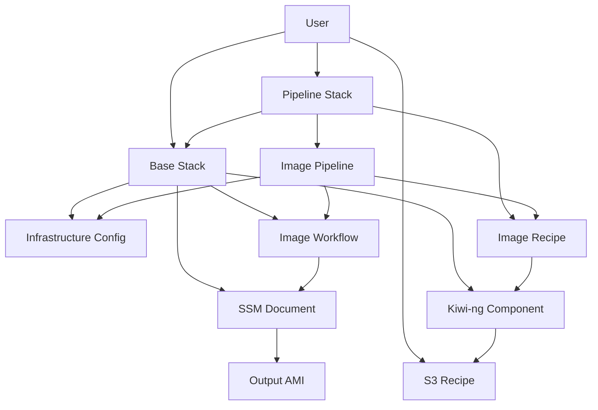
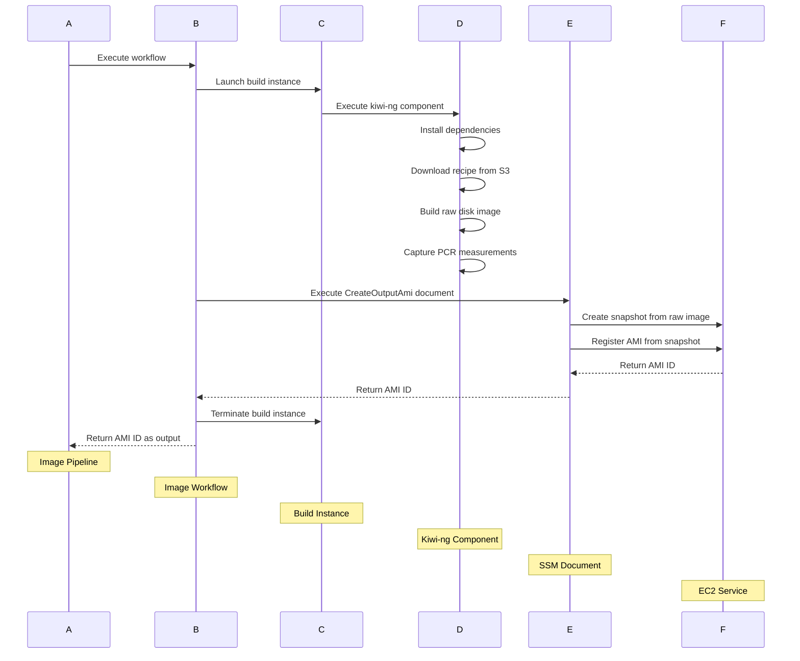

# Building Attestable Amazon Linux 2023 AMIs

This folder contains CloudFormation templates that demonstrate building attestable Amazon Linux 2023 AMIs using EC2 Image Builder and kiwi-ng.

## Documentation

For information about Attestable AMIs, see the [AWS documentation](https://docs.aws.amazon.com/AWSEC2/latest/UserGuide/attestable-ami.html).

For kiwi-ng recipes and examples, see the [Amazon Linux kiwi-image-descriptions-examples](https://github.com/amazonlinux/kiwi-image-descriptions-examples) repository.

## Architecture

Uses a two-template architecture:

- **Base Template** (`base-template.yaml`): Creates infrastructure components
- **Pipeline Template** (`pipeline-template.yaml`): Creates image recipes and pipelines

This modular approach enables pipelines to share common infrastructure while maintaining separate build configurations.

## Usage Instructions

### 1. Deploy Base Infrastructure

Deploy the base template to create shared resources:

```bash
aws cloudformation create-stack \
  --stack-name attestable-base-infra \
  --template-body file://base-template.yaml \
  --parameters ParameterKey=SubnetId,ParameterValue=subnet-12345 \
               ParameterKey=SecurityGroupId,ParameterValue=sg-67890 \
  --capabilities CAPABILITY_IAM
```

### 2. Deploy Pipeline

Deploy the pipeline template to create the image building pipeline. Use the Amazon Linux sample recipe or provide your own custom recipe.

#### Option A: Use Amazon Linux Sample Recipe

```bash
aws cloudformation create-stack \
  --stack-name attestable-ami-pipeline \
  --template-body file://pipeline-template.yaml \
  --parameters ParameterKey=BaseStackName,ParameterValue=attestable-base-infra
```

#### Option B: Use Custom Recipe

First upload your kiwi-ng recipe to an S3 bucket:

```bash
aws s3 cp recipe/ s3://your-bucket/path/to/recipe/ --recursive
```

Then deploy with the custom recipe:

```bash
aws cloudformation create-stack \
  --stack-name attestable-ami-pipeline \
  --template-body file://pipeline-template.yaml \
  --parameters ParameterKey=BaseStackName,ParameterValue=attestable-base-infra \
               ParameterKey=RecipeSource,ParameterValue=s3://your-bucket/path/to/recipe
```

### 3. Execute Pipeline

The pipeline is enabled when deployed but requires manual execution. Start the pipeline in the EC2 Image Builder console, then monitor progress.

## Template Components

### Base Template Resources

#### Infrastructure Configuration
- **IAM Roles**: Instance and execution roles with required permissions
- **S3 Bucket**: Encrypted bucket for build logs
- **Infrastructure Configuration**: Configuration for x86_64 architecture with NitroTPM support

#### Image Builder Components
- **KiwiNgComponent**: Downloads kiwi-ng recipe from S3 and builds raw disk image
- **CreateOutputAmiDocument**: SSM document that creates AMI from raw image using coldsnap
- **ImageWorkflow**: Orchestrates the build process from instance launch to AMI creation

### Pipeline Template Resources

#### Image Recipe
- References the base template's KiwiNgComponent
- Configures recipe source and PCR measurement options
- Uses latest Amazon Linux 2023 as parent image

#### Image Pipeline
- Executes the image recipe using the base template's workflow
- Supports x86_64 architecture with NitroTPM
- Uses the infrastructure configuration for build instances

## Parameters

### Base Template Parameters

| Parameter | Description | Default |
|-----------|-------------|---------|
| ResourceNamePrefix | Prefix for resource names | attestable-ami |
| SubnetId | Subnet ID for Image Builder instances | Required |
| SecurityGroupId | Security Group ID for instances | Required |
| KeyPair | SSH key pair for troubleshooting | Optional |
| TerminateInstanceOnFailure | Terminate instance on build failure | true |
| ImageBuilderResourceVersion | Version for Image Builder resources | 1.0.0 |
| InstanceType | EC2 instance type for Image Builder | c7i.2xlarge |

### Pipeline Template Parameters

| Parameter | Description | Default |
|-----------|-------------|---------|
| BaseStackName | Name of the base stack containing reusable resources | Required |
| RecipeSource | S3 URI to custom kiwi-ng recipe (optional) | Empty (uses Amazon Linux sample) |
| IncludePcrMeasurements | Include PCR4 and PCR7 measurements | yes |
| ResourceNamePrefix | Prefix for pipeline resources | attestable-ami |
| ImageBuilderResourceVersion | Version for resources | 1.0.0 |

## Build Process

The build process follows these steps:

1. **Launch Build Instance**: Creates x86_64 EC2 instance with NitroTPM support
2. **Apply Build Components**: Executes KiwiNgComponent to build raw disk image
3. **Create Output AMI**: Uses SSM document to create snapshot and register AMI with TPM 2.0 support
4. **Terminate Build Instance**: Cleans up build infrastructure

### Kiwi-ng Component Execution

The KiwiNgComponent performs these actions:

1. Installs kiwi-ng and dependencies (veritysetup, erofs-utils, coldsnap)
2. If using Amazon Linux sample recipe, installs `kiwi-image-descriptions-examples` package
3. If using custom recipe, downloads recipe from S3 location
4. Executes kiwi-ng to build raw disk image
5. Captures PCR measurements for attestation
6. Creates tag specification file for AMI metadata

### AMI Creation Process

The CreateOutputAmiDocument:

1. Retrieves instance metadata and Image Builder tags
2. Uses coldsnap to create EBS snapshot from raw image
3. Registers AMI with tags and metadata
4. Returns AMI ID to the workflow

## Architecture Diagrams

### Overall Architecture



### Build Workflow



## Kiwi-ng Recipe Options

### Amazon Linux Sample Recipe

The solution includes support for the Amazon Linux team's sample attestable image recipe. This recipe:

- Uses Amazon Linux 2023 as the base operating system
- Configures dm-verity and erofs for filesystem immutability
- Removes interactive access (SSH, EC2 Instance Connect, serial console)
- Pre-installs NitroTPM tools (`nitro-tpm-pcr-compute` and `nitro-tpm-attest`)
- Generates reference measurements during build

To use the sample recipe, deploy the pipeline template without specifying a `RecipeSource` parameter.

## Stack Management

### Cleanup
When deleting the base stack, empty the S3 log bucket first:

```bash
aws s3 rm s3://your-log-bucket-name --recursive
aws cloudformation delete-stack --stack-name attestable-base-infra
```

## Troubleshooting

### Build Failures
1. Check CloudWatch logs in `/aws/imagebuilder/` log group
2. Review S3 build logs in the created log bucket
3. Verify kiwi-ng recipe syntax and structure
4. Ensure S3 permissions allow recipe download

### Common Issues
- **Recipe not found**: Verify S3 URI format and permissions
- **Dependency failures**: Check kiwi-ng recipe dependencies
- **Snapshot creation fails**: Verify coldsnap installation and permissions

## Outputs

### Base Template Outputs
- InfrastructureConfigurationArn
- ImageBuilderExecutionRoleArn
- ImageWorkflowArn
- KiwiNgComponentArn

### Pipeline Template Outputs
- ImagePipelineArn
- ImageRecipeArn

Use these outputs to reference resources in other stacks or for monitoring purposes.
