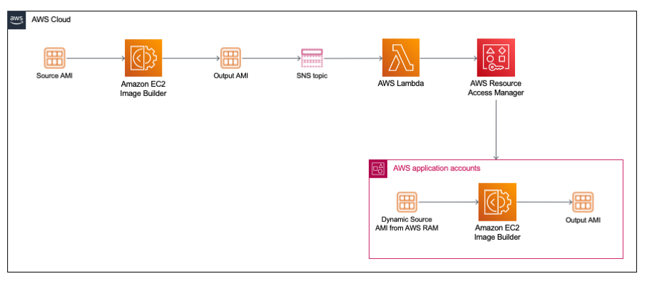

# EC2 Image Builder - Image Sharing via RAM for Dynamic Versioning

EC2 Image Builder allows customers to build an image pipeline which automates their image creation process starting from a source image installing custom software packages and security patches, the created image can then be shared across regions and other accounts.
The pipeline can be automated to run on a schedule if there is an available update of the source image or any of the build components 

Customers who have a dedicated team creating images via EC2 Image Builder service commonly share the images from a shared account.

This sample demonstrates how a child account can reference an image using a [versionless ARN](https://docs.aws.amazon.com/imagebuilder/latest/userguide/ibhow-semantic-versioning.html) to allow building against the latest shared image.

The sample CloudFromation templates creates a resource share via AWS Resource Access Manager (RAM) to share an image to an AWS Organization. It uses a Lambda Function that subscribes to the Amazon Simple Notification Service (SNS) topic to update the resource share with the latest available image.

An AWS Key Management Service (KMS) customer managed key is used to encrypt the image, and the key is shared with the child accounts.
Access to administer the AWS KMS customer managed key is provided for the AWS_AdministratorAccess Role created in the account by the AWS Single Sign-On (AWS SSO) permission set.

The child account can reference the image dynamically to ensure the latest image is used without needing to hard code the ImageId of the shared image.

To Deploy the solution please follow the following steps:

1. Deploy image-pipeline-shared-account-sample.yml in a shared account
2. Deploy share-images-ram.yml in the Shared services account
3. Run Pipeline to create an image in shared account and check RAM to see new image shared as expected
4. Deploy the image-pipeline-app-account-sample.yml
5. Run the pipeline in app account to see it creating an image starting from latest shared image