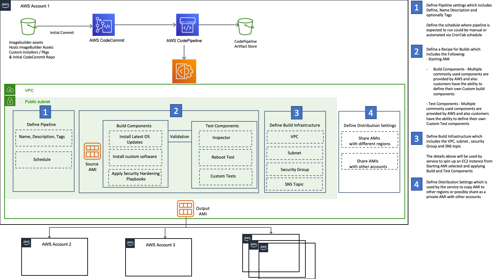
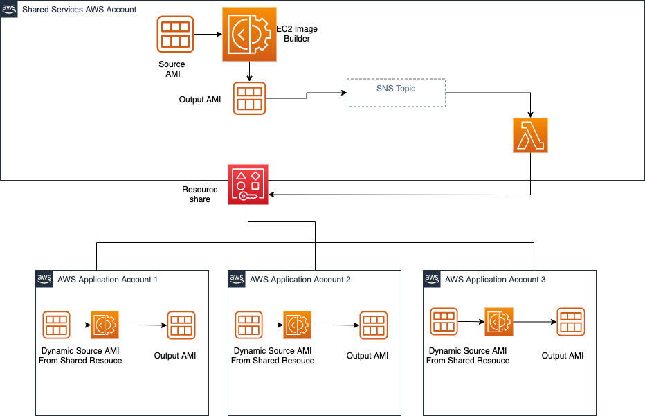

# EC2 Image Builder - Image Sharing via RAM for Dynamic Versioning

EC2 Image Builder Allows customers to build an image pipeline which automates their image creation process starting from a source image installing custom software packages and security patches, the created image can then be shared across regions and other accounts.
The pipeline can be automated to run on a schedule if there is an available update of the source image or any of the build components 

Customers who have a dedicated team creating Images via EC2ImageBuilder service usually share the images via ImageBuilder service from a shared account.

I am proposing a solution to allow teams in child accounts who need to start building their own images from the shared image by using dynamic versioning which allows the team rather than hard coding an AMI to start with the latest available image shared
for example referring to image ARN as follows -> arn:aws:imagebuilder:region:AccountId:image/amznlinux2-imagerecipe/x.x.x in the Recipe configuration

The solution is a CFN template that creates a Resource via RAM to share an image org wide from shared account and a lambda that subscribes to the SNS topic of image builder which would update the resource share with the latest available image.
a customer managed key CMK is used to encrypt image and the key is shared with application account as well.
Access to administer they CMK is provided for the AWS_Administrator Role created in the account by the AWS Single Sign on -AWS SSO permission set.

Teams in child account can then reference the image used dynamically to make sure they get latest image without needing to hard code the AMI id of the shared image

To Deploy the solution please follow the following steps:

1- Deploy ImagePipeline_SharedAccount_Sample_AmznLinux.yml in a shared account

2- Deploy ShareImages-RAM.yml in the Shared services account

3 - Run Pipeline to create an image in shared account and check RAM to see new image shared as expected

4 - Deploy the ImagePipeline_AppAccount_Sample_AmznLinux.yml

5 - Run the pipeline in app account to see it creating an image starting from latest shared image